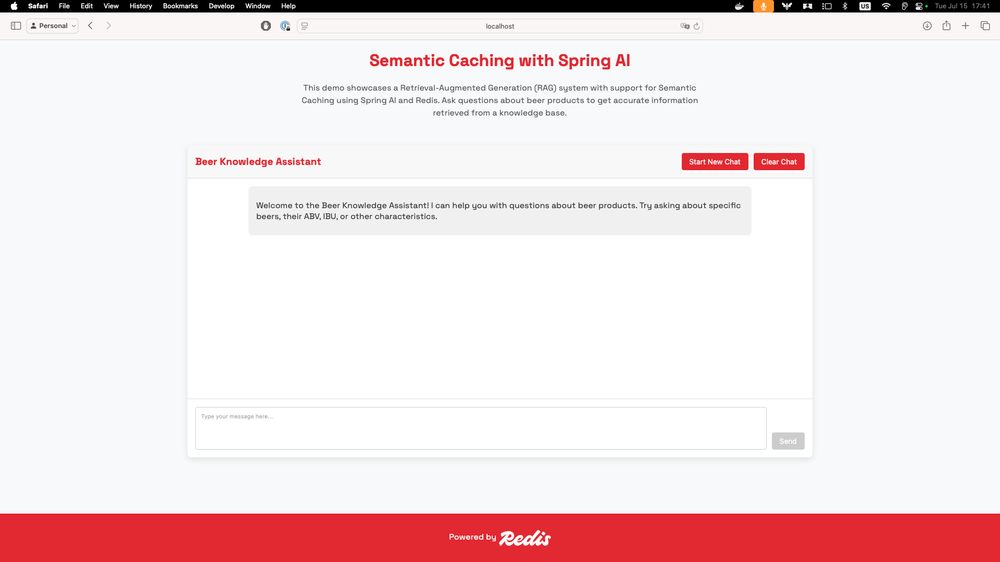
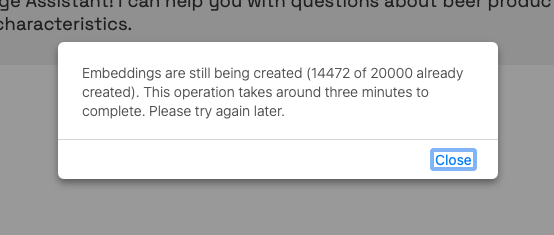
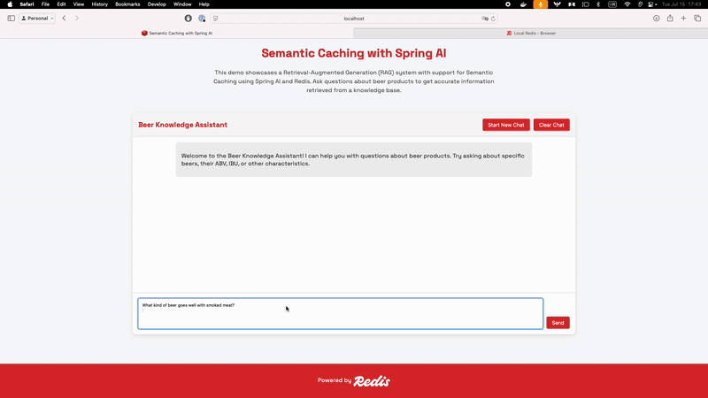
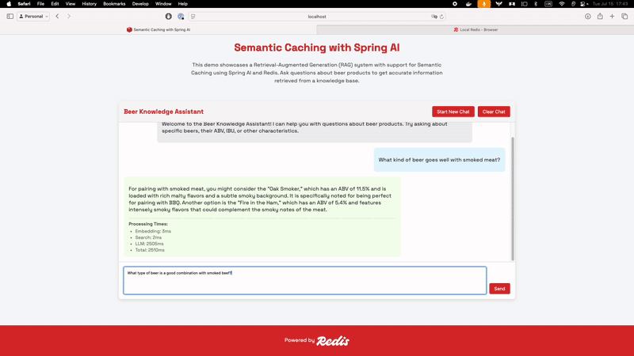

### Semantic Caching with Spring AI Demo

Semantic Caching is a technique that enhances Large Language Model (LLM) applications by caching responses based on the semantic meaning of queries rather than exact matches. This demo showcases how to implement Semantic Caching using Spring AI and Redis Vector Store to improve performance and reduce costs in a beer recommendation system.

## Learning resources:

- Video: [What is semantic caching?](https://www.youtube.com/watch?v=AtVTT_s8AGc)
- Video: [What is an embedding model?](https://youtu.be/0U1S0WSsPuE)
- Video: [Exact vs Approximate Nearest Neighbors - What's the difference?](https://youtu.be/9NvO-VdjY80)
- Video: [What is a vector database?](https://youtu.be/Yhv19le0sBw)

## Requirements

To run this demo, you’ll need the following installed on your system:
- Docker – [Install Docker](https://docs.docker.com/get-docker/)
- Docker Compose – Included with Docker Desktop or available via CLI installation guide
- An OpenAI API Key – You can get one from [platform.openai.com](https://platform.openai.com)

## Running the demo

The easiest way to run the demo is with Docker Compose, which sets up all required services in one command.

### Step 1: Clone the repository

If you haven’t already:

```bash
git clone https://github.com/redis-developer/redis-springboot-recipes.git
cd redis-springboot-recipes/artificial-intelligence/semantic-caching-with-spring-ai
```

### Step 2: Configure your environment

You can pass your OpenAI API key in two ways:

#### Option 1: Export the key via terminal

```bash
export OPENAI_API_KEY=sk-your-api-key
```

#### Option 2: Use a .env file

Create a `.env` file in the same directory as the `docker-compose.yml` file:

```env
OPENAI_API_KEY=sk-your-api-key
```

### Step 3: Start the services

```bash
docker compose up --build
```

This will start:

- redis: for storing both vector embeddings and chat history
- redis-insight: a UI to explore the Redis data
- semantic-caching-app: the Spring Boot app that implements the RAG application

## Using the demo

When all of your services are up and running. Go to `localhost:8080` to access the demo.



If you click on `Start Chat`, it may be that the embeddings are still being created, and you get a message asking for this operation to complete. This is the operation where the documents we'll search through will be turned into vectors and then stored in the database. It is done only the first time the app starts up and is required regardless of the vector database you use.



Once all the embeddings have been created, you can start asking your chatbot questions. It will semantically search through the documents we have stored, try to find the best answer for your questions, and cache the responses semantically in Redis:



If you ask something similar to a question had already been asked, your chatbot will retrieve it from the cache instead of sending the query to the LLM. Retrieving an answer much faster now.



## How It Is Implemented

The application uses Spring AI's `RedisVectorStore` to store and retrieve responses from a semantic cache.

### Configuring the Semantic Cache

```kotlin
@Bean
fun semanticCachingVectorStore(
    embeddingModel: TransformersEmbeddingModel,
    jedisPooled: JedisPooled
): RedisVectorStore {
    return RedisVectorStore.builder(jedisPooled, embeddingModel)
        .indexName("semanticCachingIdx")
        .contentFieldName("content")
        .embeddingFieldName("embedding")
        .metadataFields(
            RedisVectorStore.MetadataField("answer", Schema.FieldType.TEXT),
            )
        .prefix("semantic-caching:")
        .initializeSchema(true)
        .vectorAlgorithm(RedisVectorStore.Algorithm.HSNW)
        .build()
}
```

Let's break this down:

- **Index Name**: `semanticCachingIdx` - Redis will create an index with this name for searching cached responses
- **Content Field**: `content` - The raw prompt that will be embedded
- **Embedding Field**: `embedding` - The field that will store the resulting vector embedding
- **Metadata Fields**: `answer` - A TEXT field to store the LLM's response
- **Prefix**: `semantic-caching:` - All keys in Redis will be prefixed with this to organize the data
- **Vector Algorithm**: `HSNW` - Hierarchical Navigable Small World algorithm for efficient approximate nearest neighbor search

### Storing Responses in the Semantic Cache

When a user asks a question and the system generates a response, it stores the prompt and response in the semantic cache:

```kotlin
fun storeInCache(prompt: String, answer: String) {
    semanticCachingVectorStore.add(listOf(Document(
        prompt,
        mapOf(
            "answer" to answer
        )
    )))
}
```

This method:
1. Creates a `Document` with the prompt as the content
2. Adds the answer as metadata
3. Stores the document in the vector store, which automatically generates and stores the embedding

### Retrieving Responses from the Semantic Cache

When a user asks a question, the system first checks if there's a semantically similar question in the cache:

```kotlin
fun getFromCache(prompt: String, similarityThreshold: Double): String? {
    val results = semanticCachingVectorStore.similaritySearch(
        SearchRequest.builder()
            .query(prompt)
            .topK(1)
            .build()
    )

    if (results?.isNotEmpty() == true) {
        if (similarityThreshold < (results[0].score ?: 0.0)) {
            logger.info("Returning cached answer. Similarity score: ${results[0].score}")
            return results[0].metadata["answer"] as String
        }
    }

    return null
}
```

This method:
1. Performs a vector similarity search for the most similar prompt in the cache
2. Checks if the similarity score is above the threshold (typically 0.8)
3. If a match is found, returns the cached answer; otherwise, returns null

### Integrating with the RAG System

The RAG service integrates the semantic cache with the RAG system:

```kotlin
fun retrieve(message: String): RagResult {
    val startCachingTime = System.currentTimeMillis()
    val cachedAnswer = semanticCachingService.getFromCache(message, 0.8)
    val cachingTimeMs = System.currentTimeMillis() - startCachingTime

    if (cachedAnswer != null) {
        return RagResult(
            generation = Generation(AssistantMessage(cachedAnswer)),
            metrics = RagMetrics(
                embeddingTimeMs = 0,
                searchTimeMs = 0,
                llmTimeMs = 0,
                cachingTimeMs = cachingTimeMs
            )
        )
    }

    // Standard RAG process if no cache hit
    // ...

    // Store the response in the cache for future use
    semanticCachingService.storeInCache(message, response.result.output.text.toString())

    return RagResult(
        generation = response.result,
        metrics = RagMetrics(
            embeddingTimeMs = embeddingTimeMs,
            searchTimeMs = searchTimeMs,
            llmTimeMs = llmTimeMs,
            cachingTimeMs = 0 // Not using cache in this case
        )
    )
}
```

This orchestrates the entire process:
1. Check if there's a semantically similar prompt in the cache
2. If found, return the cached answer immediately
3. If not found, perform the standard RAG process:
   - Retrieve relevant documents using vector similarity search
   - Generate a response using the LLM
   - Store the prompt and response in the semantic cache for future use

This approach significantly improves performance and reduces costs by avoiding unnecessary LLM calls for semantically similar queries, while still providing accurate and contextually relevant responses.
