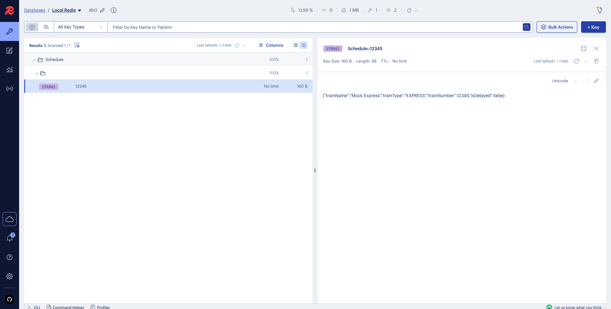

# Caching with Kotlinx Serialization (Spring + Redis)

This demo illustrates how to use Kotlinx Serialization as the serialization mechanism for Spring’s @Cacheable abstraction backed by Redis. Instead of relying on Java’s Serializable or Jackson, this setup leverages Kotlin’s idiomatic serialization for caching Kotlin data classes as JSON.

## What It Demonstrates

* How to use Kotlinx Serialization with RedisCacheManager
* Storing and retrieving Kotlin @Serializable data classes as JSON in Redis
* Avoiding SerializationException caused by JDK default serializers
* Integration with Spring’s @Cacheable using a custom RedisSerializer

## How It Works

* First call to getTrainSchedule("12345") goes through the repository
* Result is cached in Redis using RedisCacheManager with Kotlinx JSON serialization
* Second call retrieves the cached object — the repository is not called again

## Running the Demo

```bash
docker-compose up -d
```

Observe the output of TrainScheduleTestRunner:

```bash
docker-compose logs -f caching-app
```

You should be able to observe that for the first call, the repository was invoked. For the second one it wasn't, meaning that the value was retrieved from Redis.

```
Fetching train schedule first time...
💾 REPOSITORY was called for 12345
Result: TrainTicket(trainName=Mock Express, trainType=EXPRESS, trainNumber=12345, isDelayed=false)
Fetching train schedule second time (should hit cache)...
Result: TrainTicket(trainName=Mock Express, trainType=EXPRESS, trainNumber=12345, isDelayed=false)
```

Access Redis Insight on localhost:5540. Cached data will be available in Redis:



## Kotlinx Redis Serializer Setup

To use Kotlinx Serialization in Spring Cache backed by Redis, follow these steps:

### 1. Apply the Kotlinx Serialization Plugin

In your build.gradle.kts:

```kotlin
plugins {
    kotlin("plugin.serialization") version "2.2.0"
}

dependencies {
    implementation("org.jetbrains.kotlinx:kotlinx-serialization-json:1.9.0")
    implementation("org.springframework.boot:spring-boot-starter-data-redis")
}
```

### 2. Create the serializer class

```kotlin
import kotlinx.serialization.KSerializer
import kotlinx.serialization.json.Json
import kotlinx.serialization.encodeToString
import kotlinx.serialization.decodeFromString
import org.springframework.data.redis.serializer.RedisSerializer
import org.springframework.data.redis.serializer.SerializationException
import java.nio.charset.StandardCharsets

class KotlinxRedisSerializer<T : Any>(
    private val serializer: KSerializer<T>,
    private val json: Json = Json
) : RedisSerializer<T> {

    override fun serialize(t: T?): ByteArray? {
        return try {
            if (t == null) return null
            json.encodeToString(serializer, t).toByteArray(StandardCharsets.UTF_8)
        } catch (e: Exception) {
            throw SerializationException("Could not serialize: $t", e)
        }
    }

    override fun deserialize(bytes: ByteArray?): T? {
        return try {
            if (bytes == null || bytes.isEmpty()) return null
            val str = String(bytes, StandardCharsets.UTF_8)
            json.decodeFromString(serializer, str)
        } catch (e: Exception) {
            throw SerializationException("Could not deserialize", e)
        }
    }
}
```

### 3. Add a reified helper

```kotlin
import kotlinx.serialization.serializer

inline fun <reified T : Any> kotlinxRedisSerializer(
    json: Json = Json
): RedisSerializer<T> {
    return KotlinxRedisSerializer(serializer = json.serializersModule.serializer(), json = json)
}
```

### 4. Configure RedisCacheManager to use it

```kotlin
@Configuration
class RedisConfig {

    @Bean
    fun redisCacheManager(factory: RedisConnectionFactory): RedisCacheManager {
        val serializer = kotlinxRedisSerializer<TrainTicket>()

        val config = RedisCacheConfiguration.defaultCacheConfig()
            .serializeValuesWith(
                RedisSerializationContext.SerializationPair.fromSerializer(serializer)
            )

        return RedisCacheManager.builder(factory)
            .cacheDefaults(config)
            .build()
    }
}
```
