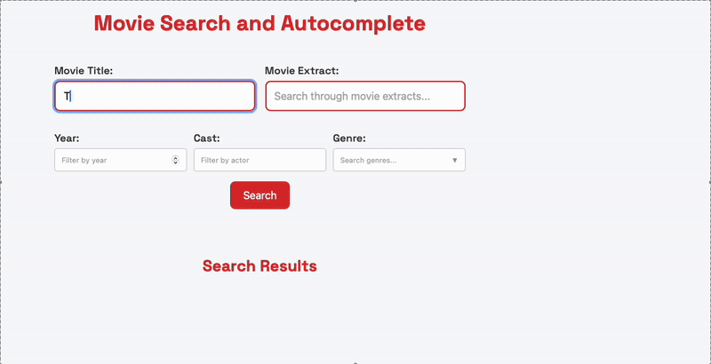

# Full-Text Search and Autocomplete with Redis OM Spring Demo

Full-text search and autocomplete are powerful features that allow users to find relevant information quickly and efficiently. Redis Query Engine provides robust capabilities for implementing these features with high performance and low latency. This demo showcases how to implement both full-text search and autocomplete functionality using Redis OM Spring, a library that simplifies working with Redis data models and the Redis Query Engine.

## Learning resources:

- Video: [Autocomplete in Spring with Redis](https://www.youtube.com/watch?v=rjaR1PR5gVk)

## Requirements

To run this demo, you’ll need the following installed on your system:
- Docker – [Install Docker](https://docs.docker.com/get-docker/)
- Docker Compose – Included with Docker Desktop or available via CLI installation guide

## Running the demo

The easiest way to run the demo is with Docker Compose, which sets up all required services in one command.

### Step 1: Clone the repository

If you haven’t already:

```bash
git clone https://github.com/redis-developer/redis-springboot-recipes.git
cd redis-springboot-recipes/search/full-text-search-and-autocomplete
```

### Step 2: Start the services

```bash
docker compose up --build
```

This will start:

- redis: for storing documents
- redis-insight: a UI to explore the Redis data
- full-text-search-and-autocomplete-app: the Spring Boot app that implements Full-text Search and Autocomplete

## Using the demo

When all of your services are up and running. Go to `localhost:8080` to access the demo.


If you start typing anything on the "title" text box, the application will try to complete the title automatically for you:



Full-text search is enabled in both title and extract fields:


Filtered search is also enabled on cast, genres, and year. The first two are indexed as `TAG` and the last is indexed as `NUMBER` in Redis:


### Redis Insight

RedisInsight is a graphical tool developed by Redis to help developers and administrators interact with and manage Redis databases more efficiently. It provides a visual interface for exploring keys, running commands, analyzing memory usage, and monitoring performance metrics in real-time. RedisInsight supports features like full-text search, time series, streams, and vector data structures, making it especially useful for working with more advanced Redis use cases. With its intuitive UI, it simplifies debugging, optimizing queries, and understanding data patterns without requiring deep familiarity with the Redis CLI.

The Docker Compose file will also spin up an instance of Redis Insight. We can access it by going to `localhost:5540`:

If we go to Redis Insight, we will be able to see the data stored in Redis:


And if run the command `FT.INFO 'com.redis.fulltextsearchandautocomplete.domain.MovieIdx'`, we'll be able to see the schema that was created for indexing our documents efficiently:


## How It Is Implemented

The application uses Redis OM Spring to index and query documents efficiently from Redis. Here's how it works:

### Defining Documents with Redis OM Spring Annotations

Documents are defined as Java classes with Redis OM Spring annotations that specify how they should be indexed:

```java
@Document
public class Movie {

    @Id
    private String id;

    @Searchable
    @AutoComplete
    private String title;

    @Indexed(sortable = true)
    private int year;

    @Indexed
    private List<String> cast;

    @Indexed
    private List<String> genres;

    @Searchable
    @AutoCompletePayload("title")
    private String extract;

    // Other fields, getters, and setters...
}
```

Let's break down the annotations:

- `@Document`: Marks the class as a Redis document to be stored in Redis
- `@Id`: Designates the primary key field
- `@Searchable`: Enables full-text search on the field
- `@AutoComplete`: Enables autocomplete functionality on the field
- `@Indexed`: Marks the field for indexing, with optional `sortable` attribute
- `@AutoCompletePayload`: Associates a payload with an autocomplete suggestion

When the application starts, Redis OM Spring automatically creates the necessary indexes in Redis based on these annotations.

### Creating Repository Interfaces for Querying

Redis OM Spring provides a repository pattern for querying Redis data:

```java
public interface MovieRepository extends RedisDocumentRepository<Movie, String> {
    List<Suggestion> autoCompleteTitle(String title, AutoCompleteOptions options);

    Iterable<String> getAllGenres();
}
```

By extending `RedisDocumentRepository`, the repository automatically gets methods for CRUD operations and basic queries. Custom methods like `autoCompleteTitle` are implemented by Redis OM Spring based on the method name and parameters.

### Implementing Full-Text Search

Full-text search is implemented using the `EntityStream` API provided by Redis OM Spring:

```java
SearchStream<Movie> stream = entityStream.of(Movie.class);
List<Movie> matchedMovies = stream
        .filter(Movie$.TITLE.containing(title))
        .filter(Movie$.EXTRACT.containing(extract))
        .filter(Movie$.CAST.eq(actors))
        .filter(Movie$.YEAR.eq(year))
        .filter(Movie$.GENRES.eq(genres))
        .sorted(Movie$.YEAR)
        .collect(Collectors.toList());
```

This creates a fluent API for building complex queries:
- `containing()` performs full-text search on text fields
- `eq()` performs exact matching on fields
- `sorted()` sorts the results by a field

Under the hood, Redis OM Spring translates these method calls into efficient Redis Query Engine commands.

### Implementing Autocomplete

Autocomplete is implemented using the repository method and the Redis Query Engine's autocomplete capabilities:

```java
List<Suggestion> suggestions = movieRepository
        .autoCompleteTitle(query, AutoCompleteOptions.get().withPayload());
```

The `autoCompleteTitle` method is automatically implemented by Redis OM Spring based on the `@AutoComplete` annotation on the `title` field. The `withPayload()` option includes the payload (in this case, the movie extract) in the suggestions.

### How Redis Indexes the Data

When documents are saved to Redis using the repository (as shown in the `MovieService` class):

```
movieRepository.saveAll(movies);
```

Redis OM Spring performs several operations:
1. Converts each document to JSON
2. Stores it in Redis with a key based on the document type and ID
3. Updates the indexes based on the annotations

For fields marked with `@Searchable`, Redis creates inverted indexes for efficient full-text search.
For fields marked with `@AutoComplete`, Redis creates specialized data structures for fast prefix matching.
For fields marked with `@Indexed`, Redis creates indexes for efficient filtering and sorting.

This approach allows for high-performance search and autocomplete operations, even with large datasets, by leveraging Redis's in-memory data structures and the Redis Query Engine's capabilities.
