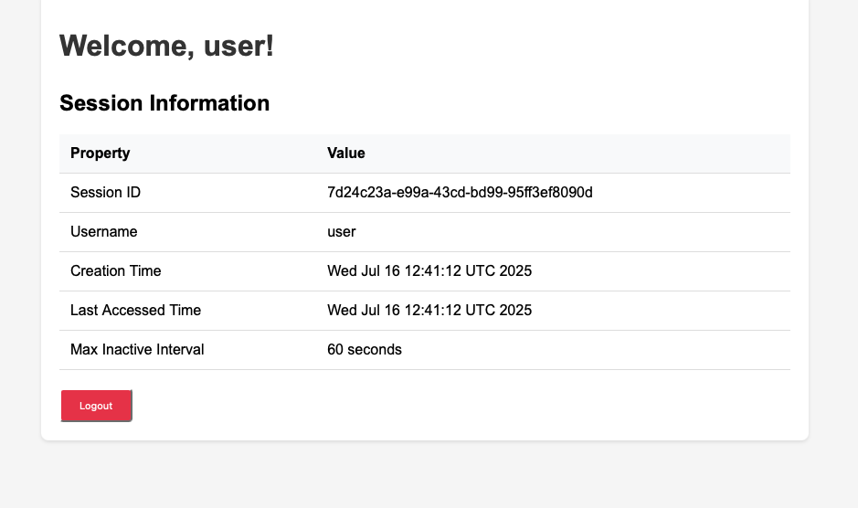
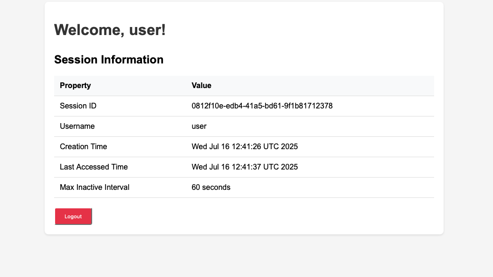
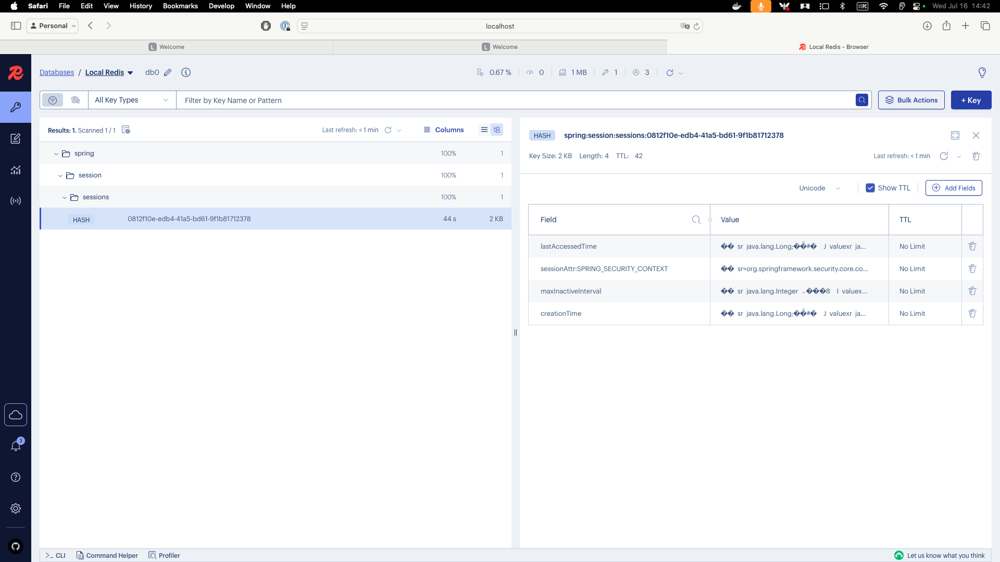

# Distributed Session Management Demo

In modern applications, relying on in-memory or file-based session storage is not enough — especially when your app is deployed in a clustered or cloud environment with multiple instances behind a load balancer. Each instance managing its own session data results in inconsistent user experiences and broken authentication flows.

To solve this, Spring provides support for distributed session management using a shared store like Redis. Instead of storing sessions in memory or on disk, session data is kept in Redis, allowing all app instances to access and update the same session regardless of which one the request hits.


## Requirements

To run this demo, you’ll need the following installed on your system:
- Docker – [Install Docker](https://docs.docker.com/get-docker/)
- Docker Compose – Included with Docker Desktop or available via CLI installation guide

## Running the demo

The easiest way to run the demo is with Docker Compose, which sets up all required services in one command.

### Step 1: Clone the repository

If you haven’t already:

```bash
git clone https://github.com/redis-developer/redis-springboot-recipes.git
cd redis-springboot-recipes/search/full-text-search-and-autocomplete
```

### Step 2: Start the services

```bash
docker compose up --build
```

This will start:

- redis: for storing documents
- redis-insight: a UI to explore the Redis data
- vector-search-spring-ai-app: the Spring Boot app that implements vector search

## Using the demo

When all of your services are up and running. Go to `localhost:8081` to access the first replica of the demo app.


Login as `user` with the password `password`. 

You will see attributes of your Session such as its `ID`, `Creation Time`, and `Access Time`:



Now, go to `localhost:8082`, the second replica of our demo app and login with the same credentials. 

Now, you will see a different `ID`, `Creation Time`, and `Access Time`:


But if we got back to `localhost:8081`, the first replica, and refresh the page, you will see that the `ID`, `Creation Time`, and `Access Time`, are the same as the second replica. Showing that they're sharing the same session. 



If we force the recreation of both instances and go to their respective endpoints again, we will see that our session is still active because it was persisted in Redis:

```bash
docker compose up --force-recreate --no-deps distributed-session-mgmt-app-1
docker compose up --force-recreate --no-deps distributed-session-mgmt-app-2
```

### Redis Insight

RedisInsight is a graphical tool developed by Redis to help developers and administrators interact with and manage Redis databases more efficiently. It provides a visual interface for exploring keys, running commands, analyzing memory usage, and monitoring performance metrics in real-time. RedisInsight supports features like full-text search, time series, streams, and vector data structures, making it especially useful for working with more advanced Redis use cases. With its intuitive UI, it simplifies debugging, optimizing queries, and understanding data patterns without requiring deep familiarity with the Redis CLI.

The Docker Compose file will also spin up an instance of Redis Insight. We can access it by going to `localhost:5540`:

If we go to Redis Insight, we will be able to see the session stored in Redis:



## How It Is Implemented

The application uses Spring Session with Redis to enable distributed session management. Here's how it works:

### Configuring Spring Session with Redis

Spring Session is enabled by including the necessary dependencies in the build.gradle.kts file:

```kotlin
dependencies {
    implementation("org.springframework.session:spring-session-data-redis")
    implementation("org.springframework.boot:spring-boot-starter-data-redis")
}
```

The Redis connection and session properties are configured in application.properties:

```properties
# Redis Configuration
spring.data.redis.host=localhost
spring.data.redis.port=6379
spring.session.redis.namespace=spring:session
spring.session.redis.flush-mode=immediate
spring.session.redis.repository-type=default

# Session Configuration
server.servlet.session.cookie.http-only=true
server.servlet.session.cookie.secure=false
server.servlet.session.tracking-modes=cookie
server.servlet.session.timeout=60s
```

These properties configure:
- The Redis connection details (host and port)
- The namespace for storing session data in Redis
- The flush mode (immediate means changes are written to Redis immediately)
- The repository type (default uses the standard Spring Session repository implementation)
- Session cookie settings and timeout

### Configuring Session Management in Spring Security

The SecurityConfig class configures session management with Spring Security:

```kotlin
@Configuration
@EnableWebSecurity
class SecurityConfig {
    @Bean
    fun securityFilterChain(http: HttpSecurity): SecurityFilterChain {
        http
            // Other security configuration...
            .sessionManagement { session ->
                session
                    .sessionCreationPolicy(SessionCreationPolicy.ALWAYS)
                    .invalidSessionUrl("/login?invalid")
                    .sessionFixation { it.newSession() }
                    .maximumSessions(2)
                    .maxSessionsPreventsLogin(true)
                    .expiredUrl("/login?expired")
            }

        return http.build()
    }

    @Bean
    fun sessionRegistry(): SessionRegistry = SessionRegistryImpl()

    @Bean
    fun sessionAuthenticationStrategy(): SessionAuthenticationStrategy =
        RegisterSessionAuthenticationStrategy(sessionRegistry())

    @Bean
    fun httpSessionEventPublisher(): HttpSessionEventPublisher = HttpSessionEventPublisher()
}
```

This configuration:
- Sets the session creation policy to ALWAYS (a session is always created)
- Configures session fixation protection (creates a new session on authentication)
- Limits the maximum number of concurrent sessions per user to 2
- Prevents new logins if the maximum number of sessions is reached
- Provides beans for session registry and event publishing

### Using Sessions in Controllers

The application interacts with the session through the standard HttpSession object:

```kotlin
@Controller
class WelcomeController {
    @GetMapping("/welcome")
    fun welcome(session: HttpSession, principal: Principal, model: Model): String {
        val sessionInfo = LinkedHashMap<String, Any>().apply {
            put("Session ID", session.id)
            put("Username", principal.name)
            put("Creation Time", Date(session.creationTime))
            put("Last Accessed Time", Date(session.lastAccessedTime))
            put("Max Inactive Interval", "${session.maxInactiveInterval} seconds")
        }

        model.addAttribute("sessionInfo", sessionInfo)
        return "welcome"
    }
}
```

The SessionController provides REST endpoints for session management:

```kotlin
@RestController
@RequestMapping("/api")
class SessionController {
    @GetMapping("/session-info")
    fun getSessionInfo(session: HttpSession, principal: Principal): MutableMap<String?, Any?> {
        val sessionInfo: MutableMap<String?, Any?> = HashMap<String?, Any?>()
        sessionInfo.put("sessionId", session.id)
        sessionInfo.put("creationTime", session.creationTime)
        sessionInfo.put("lastAccessedTime", session.lastAccessedTime)
        sessionInfo.put("maxInactiveInterval", session.maxInactiveInterval)
        sessionInfo.put("username", principal.name)
        return sessionInfo
    }

    @PostMapping("/session-attribute")
    fun setSessionAttribute(
        @RequestParam key: String?,
        @RequestParam value: String?,
        session: HttpSession
    ) {
        session.setAttribute(key, value)
    }

    @GetMapping("/session-attribute")
    fun getSessionAttribute(
        @RequestParam key: String?,
        session: HttpSession
    ): Any? {
        return session.getAttribute(key)
    }
}
```

### Distributed Deployment with Docker Compose

The application is deployed as two separate instances that share the same Redis instance for session storage:

```yaml
services:
  redis:
    image: redis:latest
    ports:
      - "6379:6379"
    # Other configuration...

  # First instance
  distributed-session-mgmt-app-1:
    # Base configuration...
    ports:
      - "8081:8080"

  # Second instance
  distributed-session-mgmt-app-2:
    # Base configuration...
    ports:
      - "8082:8080"
```

Both application instances connect to the same Redis server:

```yaml
environment:
  - SPRING_DATA_REDIS_HOST=redis
  - SPRING_DATA_REDIS_PORT=6379
```

### How Sessions are Stored in Redis

When a user logs in, Spring Session:

1. Creates a session with a unique ID
2. Serializes the session data
3. Stores it in Redis under a key with the format `spring:session:sessions:<session-id>`
4. Sets an expiration time based on the configured session timeout

When a request comes in with a session cookie:

1. Spring Session extracts the session ID from the cookie
2. Retrieves the session data from Redis
3. Deserializes it into a HttpSession object
4. Makes it available to the application

This allows multiple application instances to share session data seamlessly, providing a consistent user experience regardless of which instance handles a particular request.

The session data in Redis includes:
- Session attributes
- Creation time
- Last accessed time
- Maximum inactive interval
- Principal name (username)

You can view this data in Redis Insight, as shown in the screenshot above.
